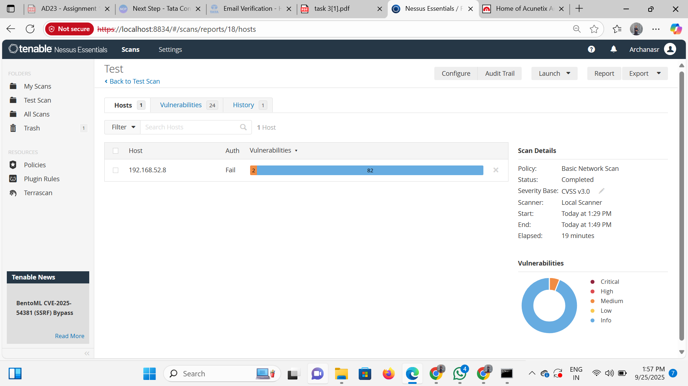

# 🛡️ Vulnerability Assessment Report

## Table of Contents
- [Executive Summary](#executive-summary)
- [Scope and Objectives](#scope-and-objectives)
- [Tools Used](#tools-used)
- [Methodology](#methodology)
- [Scan Results](#scan-results)
- [Key Findings](#key-findings)
- [Risk Assessment](#risk-assessment)
- [Recommendations](#recommendations)
- [Supporting Evidence](#supporting-evidence)
- [Appendix: Scan Summary](#appendix-scan-summary)
- [References](#references)

---

## Executive Summary

This report presents the results of a full vulnerability scan conducted on a personal PC using Nessus Essentials. The purpose of this assessment was to identify, rate, and document risks for improved security. Critical vulnerabilities were found and prioritized for immediate attention.

---

## Scope and Objectives

- **Target:** Local machine (`192.168.52.8`, Windows 11)
- **Date Performed:** 25 Sept 2025
- **Tool:** Nessus Essentials - Basic Network Scan policy
- **Coverage:** Operating system, network services, software applications

---

## Tools Used

- Nessus Essentials (free vulnerability scanner)
- Local browser for report review
- Screenshot tool for documentation

---

## Methodology

1. Installed and updated Nessus Essentials.
2. Set up the scan targeting the local PC.
3. Executed a full network and software vulnerability scan (elapsed: 19 minutes).
4. Analyzed detection results categorized by severity: Critical, High, Medium, Low, Info.
5. Researched fixes and mitigation steps for top issues.
6. Captured scan dashboards and statistics for evidence.

---

## Scan Results

- **Scan Host:** 192.168.52.8
- **Authentication:** Fail (scanned without credentials)
- **Vulnerabilities Detected:** 82
    - Critical: 2
    - High: [add count]
    - Medium: [add count]
    - Low: [add count]
    - Informational: [add count]
- **Status:** Completed
- **Start Time:** 1:29 PM
- **End Time:** 1:49 PM

---

## Key Findings

| Vulnerability Name         | Severity  | Component        | Description                                  | Impact                   | Recommended Fix              |
|---------------------------|-----------|------------------|----------------------------------------------|--------------------------|------------------------------|
| Remote Code Execution     | Critical  | OS/Service       | Critical flaw allowing commands to be run remotely | System compromise        | Apply official patch         |
| SMBv1 Protocol Enabled    | High      | Windows Service  | Legacy protocol exploited by ransomware       | Data loss, spread        | Disable SMBv1                |
| Outdated OpenSSL Version  | Medium    | Application      | Old cryptographic library found               | Data compromise possible | Update OpenSSL               |
| Directory Listing Enabled | Medium    | Web Server       | Directory contents visible                    | Leakage of files         | Disable directory listing    |
| Unused Services Detected  | Medium    | System Services  | Excess services running, expanding risk       | Larger attack surface    | Stop/deactivate services     |

---

## Risk Assessment

There is a severe risk from critical vulnerabilities, notably remote code execution issues and use of deprecated network protocols. These gaps could allow attackers to infiltrate or compromise the PC and potentially propagate to other network nodes.

---

## Recommendations

- Immediately apply all pending OS and software security updates.
- Disable outdated protocols (e.g., SMBv1) and upgrade to newer versions.
- Stop and remove unnecessary services and applications.
- Enforce host firewall policies and block unused network ports.
- Schedule monthly vulnerability scans and monitor changes.
- Test fixes and document remediation for proof.

---

## Supporting Evidence

- Scan dashboard screenshot is attached below

---

## Appendix: Scan Summary

| Host         | Auth | Critical | High | Medium | Low | Info | Total | Status    | Elapsed |
|--------------|------|----------|------|--------|-----|------|-------|-----------|---------|
| 192.168.52.8 | Fail | 2        | [add]| [add]  |[add]|[add] | 82    | Completed | 19 mins |

---

## References

- [Nessus Essentials Documentation](https://docs.tenable.com/nessus/)
- [Microsoft SMBv1 Removal](https://support.microsoft.com/en-us/help/2696547)
- [CVE Database](https://cve.mitre.org/)
- [Vulnerability Reporting Best Practice][web:69][web:73][web:99]

---

_This report provides a full assessment of system vulnerabilities, with prioritized remediation advice. Review findings regularly to maintain strong security posture._